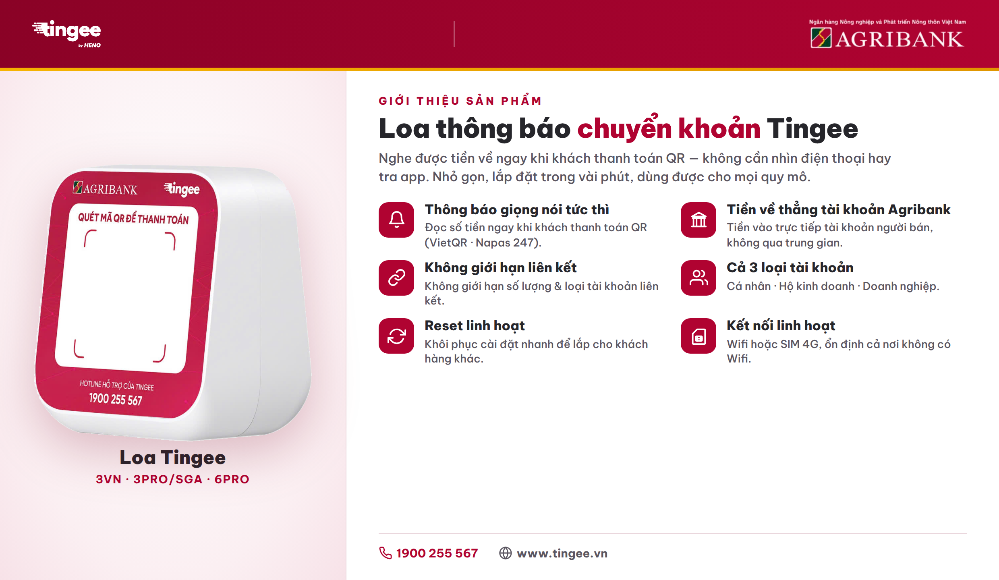

# Giới thiệu sản phẩm

## Loa thông báo chuyển khoản Tingee

<figure><figcaption></figcaption></figure>

**Tingee (TingeeBox)** là thiết bị loa thông báo chuyển khoản giúp người bán **nghe được tiền về ngay khi khách thanh toán QR** — không cần nhìn điện thoại hay mở app kiểm tra. Thiết bị nhỏ gọn, lắp đặt trong vài phút, dùng được từ hộ kinh doanh nhỏ đến doanh nghiệp.

Hiện có **3 phiên bản**: **3VN** (Wifi), **3PRO/SGA** (SIM 4G + Wifi) và **6PRO** (SIM 4G + Wifi, kèm màn hình LED 8 số).

### Tính năng nổi bật

* 🔔 **Thông báo bằng giọng nói tức thì** — đọc số tiền ngay khi có giao dịch QR thành công (VietQR / Napas 247).
* 🏦 **Tiền về trực tiếp tài khoản Agribank** của người bán — không qua trung gian, không giữ tiền.
* 🔗 **Không giới hạn liên kết** — không giới hạn số lượng tài khoản liên kết và không giới hạn loại tài khoản.
* 👥 **Hỗ trợ cả 3 loại tài khoản** — cá nhân, hộ kinh doanh và doanh nghiệp.
* 🔁 **Reset linh hoạt** — dễ dàng khôi phục cài đặt để lắp đặt cho khách hàng khác.
* 📶 **Kết nối linh hoạt** — Wifi hoặc SIM 4G (tùy phiên bản), hoạt động ổn định cả ở nơi không có Wifi.
* 🔋 **Pin Li-ion 2000–2600mAh**, sạc cổng Type-C; loa công suất **3W–5W** nghe rõ trong môi trường ồn.
* 🖥️ **Màn hình LED 8 số** hiển thị số tiền giao dịch (riêng bản **6PRO**).

### Thông số nhanh

| Phiên bản    | Kết nối       | Loa | Pin     | Đặc điểm                    |
| ------------ | ------------- | --- | ------- | --------------------------- |
| **3VN**      | Chỉ Wifi      | 3W  | 2000mAh | Gọn nhẹ, lắp nhanh          |
| **3PRO/SGA** | SIM 4G + Wifi | 3W  | 2000mAh | Kết nối kép, 2 mặt thiết kế |
| **6PRO**     | SIM 4G + Wifi | 5W  | 2600mAh | Màn hình LED 8 số           |

### Phụ kiện đi kèm

Mỗi máy gồm: **1 cáp sạc Type-C**, hướng dẫn sử dụng và mã QR. _(Bản 3PRO/SGA và 6PRO chưa bao gồm SIM 4G.)_
