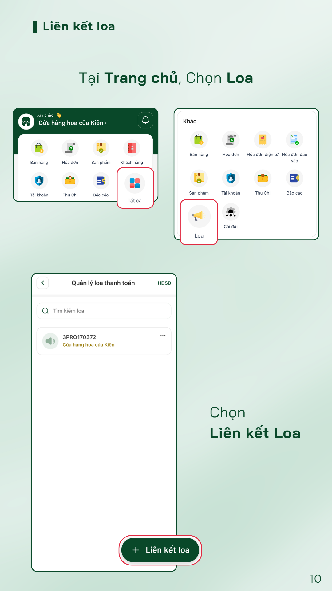
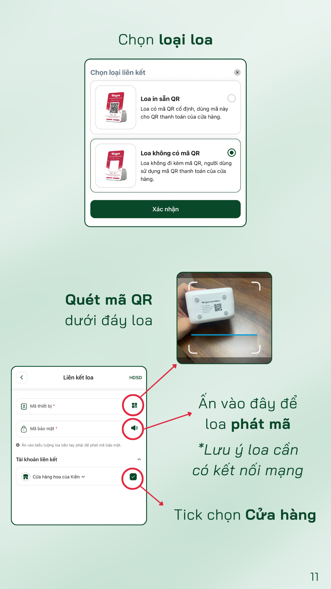

# Liên kết qua App FinOne

**Hướng dẫn liên kết loa**

**Bước 1:** Tại **Trang chủ**, chọn **Tất cả** → chọn biểu tượng **Loa**.

**Bước 2:** Tại màn hình **Quản lý loa thanh toán**, nhấn **+ Liên kết loa**.

**Bước 3:** Chọn **loại loa** cần liên kết, sau đó nhấn **Xác nhận**:

* **Loa in sẵn QR**: loa có mã QR cố định, dùng làm mã QR thanh toán của cửa hàng.
* **Loa không có mã QR**: dùng mã QR thanh toán sẵn có của cửa hàng.

**Bước 4:** Nhập thông tin liên kết:

* **Mã thiết bị**: nhấn biểu tượng QR để **quét mã QR dưới đáy loa**.
* **Mã bảo mật**: nhấn biểu tượng loa bên phải để **loa phát mã** _(lưu ý: loa cần có kết nối mạng)_.
* **Tài khoản liên kết**: **tick chọn Cửa hàng** muốn liên kết.

**Bước 5:** Hoàn tất để kết thúc quá trình liên kết loa.

<figure><figcaption></figcaption></figure> <figure><figcaption></figcaption></figure>

